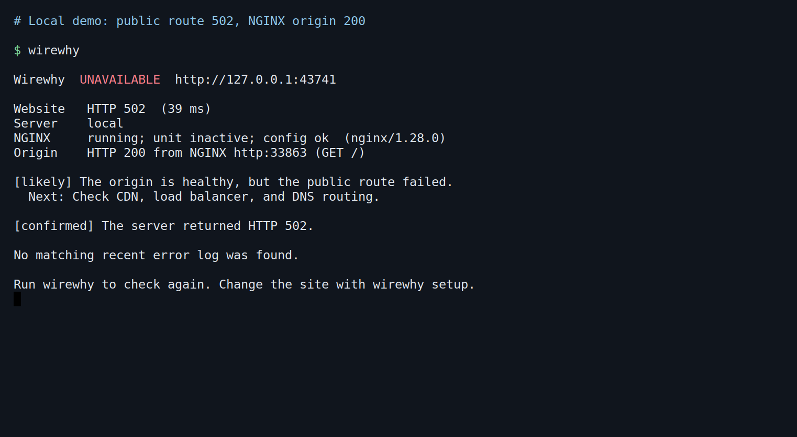

# Wirewhy

[](https://github.com/Aaron-Savron/wirewhy/actions/workflows/ci.yml)

See whether a website outage is at the public edge or the NGINX origin, then find the relevant logs.



Node 20.3 or newer. Zero runtime dependencies. CommonJS and ESM, with TypeScript types.

```sh
npm install -g github:Aaron-Savron/wirewhy
wirewhy
```

The first run asks for the website and optional server. Later, `wirewhy` checks that saved site directly. Use `wirewhy setup` to change it.

You can also clone the repo and run `npm install -g .`. An npm registry release is pending.

## Server checks

```sh
wirewhy example.com
wirewhy setup https://example.com --ssh production --sudo
wirewhy --logs
wirewhy site https://example.com --local --service app.service
wirewhy --format json --output report.json
```

Site checks use GET and inspect up to 1 MB of the response. On failure, Wirewhy probes `/` directly against the matching NGINX listener on the server, preserving the site's Host header and TLS SNI. The probe does not send the URL path or query. Seeing a healthy origin beside a failed public response points you toward the CDN, load balancer, or DNS; a failed origin keeps the focus on NGINX and the app. The report then shows relevant logs.

NGINX config supplies log paths and upstream ports, including named upstreams. Wirewhy discovers a systemd app service from a listening upstream port and remembers it for later crash checks. Use `--service app.service` or `--log /var/log/app.log` to specify one.

Server checks need Linux and Python 3, locally or on the SSH server. No remote agent is installed. `--sudo` uses `sudo -n`; it never prompts for a password. Checks do not restart or reload services.

Options include `--ssh-config /path/config`, `--nginx-config /path/nginx.conf`, `--timeout 5000`, and `--format text|json|markdown`. Missing permissions remain visible in the report.

Settings are stored in `~/.config/wirewhy/config.json` (`XDG_CONFIG_HOME` is respected). A project’s `wirewhy.config.json` overrides the saved site. `WIREWHY_CONFIG` selects a different file.

Each run is a single check. Server checks support NGINX and systemd; use `--log` for other app processes. A successful HTTP response does not verify browser rendering or application correctness.

## Request debugging

```sh
wirewhy check https://api.example.com
wirewhy run -- npm run dev
wirewhy run --output reports.jsonl -- node app.js
```

`check` sends HEAD. Use `--method GET` to change it.

`run` observes native fetch and Undici requests in the command and its Node children. Reports go to stderr. `--output` appends JSONL to a file. `--all` includes completed successful requests. The application keeps its own exit code.

Exit codes: 0 for success, 1 for a failed site or request, 2 for invalid input or an I/O error. `run` preserves the application’s exit code.

## Package

```js
import { explain, formatReport } from 'wirewhy';

try {
  await fetch(url);
} catch (error) {
  console.error(formatReport(explain(error, { url })));
}
```

`explain` is synchronous. `diagnose(url)` runs DNS, TCP, and TLS checks after request failures. `inspectSite(url, options)` adds server health and logs. `observe({ onReport })` watches native fetch and Undici without replacing them. Preload with `node --require wirewhy/register app.js`.

## Reports

Findings carry confidence labels and next steps. Request reports omit URL paths, queries, headers, bodies, and raw error messages. Log excerpts retain errors and stack locations, with common credentials and request URLs redacted. Matching logs show relevant evidence, not proof of causation.

## Development

```sh
npm ci
npm run check
npm run demo
npm pack
```

See [API](docs/api.md) for signatures and [release notes](docs/releasing.md) for packaging.
